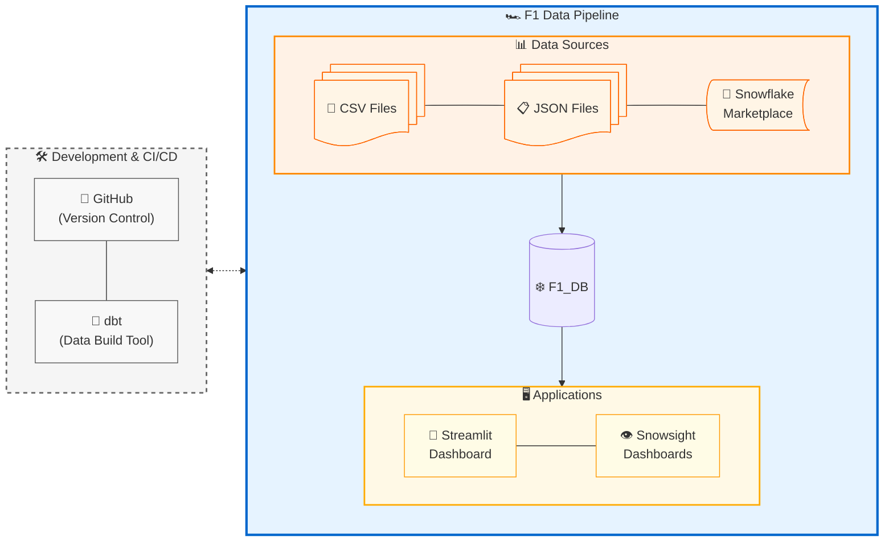

# Project Documentation: Formula 1 & Weather Data Pipeline on Snowflake

**Version:** 1.0
**Date:** 2025-06-05
**Author(s):** [Your Name/Team Name]

## 1. Project Overview

This document details the design, implementation, and operational aspects of the Formula 1 (F1) and Weather Data 
Pipeline project. The primary objective is to demonstrate an end-to-end data engineering workflow within 
Snowflake, encompassing data extraction from diverse sources, loading, transformation, and preparation for 
analytical consumption.

A key aspect of this project was the design of a layered database architecture, utilizing distinct Snowflake schemas 
to represent the different stages of data progression: staging, refinement, and delivery. Guidance was also 
incorporated on establishing a robust role-based access control system, including the assignment of appropriate permissions for database objects. Furthermore, this project 
explored collaborative development practices through the integration of dbt for data transformation and 
GitHub for version control and teamwork.

The project leverages various F1 datasets (circuits, drivers, races, results, lap times, etc.) and corresponding 
weather data to create a comprehensive analytical environment. 
In the delivery stage, data is presented as dashboards using the built in snowsight capabilites to create dashboards 
and streamlit. 

## 2. Data Extraction

The initial phase of the pipeline focuses on acquiring raw data from various sources.

* **Formula 1 Data:**
    * **Sources:**
        * [Kaggle F1 datasets](https://www.kaggle.com/datasets/rohanrao/formula-1-world-championship-1950-2020/data?select=status.csv)
        * Python library: FastF1 (Lap data, weather data)    
    * **Entities:** * Data includes information about circuits, drivers, constructors, race schedules, race results, qualifying results, lap times, pit stops, driver standings, tyre information, weather data
    * **Format:** CSV files for most (status, races, circuits, drivers, results, tyres). Lap information was transformed to JSON format.
* **Weather Data:**
    * **Sources:** * Snowflake Marketplace (sample from Accuweather historical data)
        * Python library: FastF1 (Lap data, weather data) 
    * **Entities:** Historical weather conditions (temperature, precipitation, wind speed, humidity, etc.) corresponding to F1 race locations and dates.
    * **Format:** CSV files and tables from Marketplace
* **Extraction Method:**
    * CSV files were uploaded from a stage using snowsight UI.
    * JSON data was originally CSV and then changed to JSON using python [code here](/Additional%20code/load_json.sql).
    * FastF1 library used within Python scripts to fetch specific data, [code here](/Additional%20code/load_json.sql).[EWA to add this script]
    * Snowflake Marketplace data accessed directly via shared databases.

## 3. Snowflake Database Setup

A dedicated Snowflake database and structured schemas form the foundation of this pipeline.

### 3.1. Database Creation
A new database named `F1_DB` was created to house all data, schemas, and objects related to this project.

### 3.2. Schema Architecture (Data Layers)
The `F1_DB` database is organized into three distinct schemas, representing the different stages of the data lifecycle:




* **`STAGING` Schema (Staging Layer):**
    * **Purpose:** This layer serves as the initial landing zone for all raw data extracted from the source systems. Data here is typically a direct copy or minimally processed version of the source data.
    * **Contents:** Raw tables corresponding to each extracted CSV and JSON file.

* **`REFINEMENT` Schema (Refinement Layer):**
    * **Purpose:** while some tables only required eliminating uninteresting columns (circuits, drivers, lap_times) other tables required joining (results, tyres) and further aggregated operations (weather_refined)
    * **Contents:** * **`DELIVERY` Schema (Delivery Layer):**
    * **Purpose:** This layer contains the final, presentation-ready datasets. We decided to create specific denormalized tables that provide the information necessary to generate the visuals that show the insights we want to describe.
    * **Contents:** ### 3.3. Roles and Access Control
A role-based access control (RBAC) model was implemented to manage permissions within `F1_DB`.

* **Administrative Setup:**
    * An administrative role (in this case `TRAINING_ROLE` had enough permissions to do this 'admin' job) was used to create the `F1_DB` database, the `STAGING`, `REFINEMENT`, and `DELIVERY` schemas. [SQL code] ()

* **Functional Roles:**
    The following roles have been created and granted privileges to work on the `F1_DB`:
    * `EAGLE`
    * `COBRA`
    * `JELLYFISH`
    * `GRIZZLY`
    * `FLAMINGO`

    These five roles are intended for users actively involved in developing, maintaining, and utilizing the data pipeline. They have been granted comprehensive permissions to perform most operations within the `F1_DB` relevant to their functions (e.g., read/write on schemas, usage on warehouses).

* **Dashboard Consumer Role:**
    * `DASHBOARD_ROLE`: This role has restricted, read-only access, primarily to objects within the `DELIVERY` schema. This is intended for users who only consume the final dashboards and reports, ensuring they cannot modify underlying data or structures. [SQL code](/Additional%20code/Dashboard_access_role.sql)


## 4. Data Loading (Staging Layer)

Once the raw data files (CSVs, JSON) were extracted, they were loaded into the `STAGING` schema in `F1_DB`.

* **Mechanism:** Snowflake internal/external stages were utilized as interim storage for the data files, created using Snowsight UI. Each user was tasked to generate a stage and load the data from there into the RAW schema.
    * CSV files were uploaded from a stage using snowsight UI.
    * This SQL code was used to create the stage, load the JSON data and then parse it into a table created in RAW schema. [Link to SQL code]()
    * Snowflake Marketplace data accessed directly via shared databases, then the selected data was copied into a table:

* **Loading into Tables:** The `COPY INTO <table>` command was used to load data from the staged files into corresponding raw tables within the `STAGING` schema.
    * File formats were defined to correctly parse CSV (delimiters, headers) and JSON data.

    ```sql
    COPY INTO @WEATHER/weather_cities.csv
      FROM (
        SELECT *
        FROM SAMPLE_OF_ACCUWEATHERS_HISTORICAL_WEATHER_DATA.HISTORICAL.TOP_CITY_DAILY_METEOROLOGICAL_METRIC
      )
      FILE_FORMAT = (TYPE = 'CSV');
    ```


## 5. Data Transformations (Refinement Layer)

Data residing in the `STAGING` schema is then processed and moved to the `REFINEMENT` schema. This layer focuses on preparing the data for reliable and efficient analysis.

* **General Process:** The transformation process varied depending on the dataset. Common operations included:
    * **Column Selection/Elimination:** For some tables like `circuits`, `drivers`, and `lap_times`, the primary transformation involved selecting essential columns and removing uninteresting or redundant ones.
    * **Data Cleaning:** Standardizing formats, handling null values (e.g., replacing with defaults or removing rows where critical data was missing), and general data cleansing.
    * **Data Type Conversion:** Ensuring data types were appropriate for analysis (e.g., converting strings to dates, numbers, or booleans).
    * **Joining Datasets:** Several tables required joining to enrich the data. For instance, `results` data was joined with driver and race details, and `tyres` information was linked to specific drivers and races.
    * **Aggregated Operations:** For certain datasets, like `weather` data, further aggregations were performed to derive meaningful metrics (e.g., average temperature during a race, predominant weather conditions).
    * **Validation:** Basic validation checks were performed to ensure data integrity after transformations. This was performed using DBT's standard tests.
* **Specific Transformations & Joins:**
   link to code, link to code


## 6. Data Delivery (Delivery Layer)

The `DELIVERY` schema houses the final datasets optimized for consumption by dashboards.

* **Purpose:** The tables are denormalized and aggregated to provide fast and easy access to information required for specific reports or analyses. So far there is one table where the information is extracted from.
* **Key Tables/Views for Dashboards:**
    
    * `F1_DB.DELIVERY.DASHBOARD`: Contains detailed race results joined with driver, lap_times, circuit, tyre and weather information.(Should we add the columns here?)
   

## 7. Streamlit Integration

The data prepared in the `DELIVERY` layer is visualized and interacted with via a Streamlit application.

* **Purpose:** To provide an interactive web-based interface for exploring F1 data insights.
* **Integration Details:**
    * The Streamlit application connects to Snowflake using the Snowflake Connector for Python.
    * Queries are executed against tables/views in the `F1_DB.DELIVERY` schema.
    * Using different APIs, we pull the circuit outline, information about it from wikipedia and displayed some visualizations
* **Streamlit Code Snippets/Reference:**
    ```python
    # Placeholder for Python/Streamlit code
    # User to provide key snippets for connecting to Snowflake and fetching/displaying data.
    # Example:
    # import streamlit as st
    # import snowflake.connector
    # import pandas as pd

    # # Initialize connection.
    # # Uses st.experimental_singleton to only run once.
    # @st.experimental_singleton
    # def init_connection():
    #     return snowflake.connector.connect(
    #         **st.secrets["snowflake"], client_session_keep_alive=True
    #     )

    # conn = init_connection()

    # # Perform query.
    # # Uses st.experimental_memo to only rerun when the query changes or after 10 min.
    # @st.experimental_memo(ttl=600)
    # def run_query(query):
    #     with conn.cursor() as cur:
    #         cur.execute(query)
    #         return cur.fetchall()

    # # Example usage:
    # # rows = run_query("SELECT * FROM F1_DB.DELIVERY.fct_race_analysis LIMIT 10;")
    # # df = pd.DataFrame(rows, columns=[desc[0] for desc in conn.cursor().description]) # Adjust column fetching
    # # st.dataframe(df)
    ```

## 8. dbt (Data Build Tool) Implementation

In parallel to direct SQL-based transformations, dbt was utilized to test its functionality and explore its benefits for managing the data transformation workflow.

* **Scope of dbt Use:** dbt was used to replicate the whole pipeline, in a different schema(each DBT user has its own schema).
    * Part of the diagrams shown here as well as the list of tables are taking from DBT documentation.
* **Key dbt Features Leveraged:**
    * **Models:** SQL `SELECT` statements defining tables/views.
    * **Sources:** Declaring raw data tables from the `STAGING` schema.
    * **Tests:** Schema tests (unique, not_null) performed to check data consistency.
    * **Documentation:** Generation of project documentation and data lineage graphs used also in this documentation.
    
* **dbt Project Structure & Documentation:**
    * The DBT project is similarly structured as the original one. This is the YML file of the project. Remaining files are found within the github repo. The configuration is set to generate views for the raw data and tables for the refinement and delivery schema.
   
    ```yaml
    # name: 'F1_DBT_project'
      version: '1.0.0'
      config-version: 2

    # This setting configures which "profile" dbt uses for this project.
      profile: 'default'
      model-paths: ["models"]
      analysis-paths: ["analyses"]
      test-paths: ["tests"]
      seed-paths: ["seeds"]
      macro-paths: ["macros"]
      snapshot-paths: ["snapshots"]

     target-path: "target"  # directory which will store compiled SQL files
         clean-targets:         # directories to be removed by `dbt clean`
         - "target"
         - "dbt_packages"


    # Configuring models
    # Full documentation: https://docs.getdbt.com/docs/configuring-models

# In dbt, the default materialization for a model is a view. This means, when you run 
# dbt run or dbt build, all of your models will be built as a view in your data platform. 
# The configuration below will override this setting for models in the example folder to 
# instead be materialized as tables. Any models you add to the root of the models folder will 
# continue to be built as views. These settings can be overridden in the individual model files
# using the `{{ config(...) }}` macro.

     models:
       F1_DBT_project:
        # Applies to all files under models/example/
         staging:
          +materialized: view
        refinement:
          +materialized: table

    ```
* **Observations/Benefits Noted:** [User to add insights, e.g., improved modularity, automated testing, version control benefits, easier documentation and lineage tracking.]

## 9. Data Quality & Testing

Ensuring data accuracy and reliability is critical.

* **Staging Layer:** Basic checks during loading (e.g., file format validation, row counts).
* **Refinement Layer:**
    * Application of data cleaning rules (handling NULLs, outliers).
    * Data type enforcement.
    * Referential integrity checks (e.g., ensuring `statusID` in results exists in `status_mapping`).
    * If using dbt, schema tests (`unique`, `not_null`, `accepted_values`, `relationships`) and custom data tests were implemented.
* **Delivery Layer:** Validation of aggregations and final metrics against known totals or benchmarks.

## 10. Orchestration & Scheduling

The pipeline's execution is managed to ensure timely data updates.

* **Loading (Staging):** [User to describe: e.g., Manual for this demo, or scheduled via external scripts/Snowflake Tasks if automated.]
* **Transformations (Refinement & Delivery):**
    * [User to describe: e.g., Manual execution of SQL scripts/dbt commands for this demo.]
    * [User to describe potential for automation: e.g., Using Snowflake Tasks to run SQL, or a scheduler like dbt Cloud, Airflow, or cron for dbt jobs.]

## 11. Performance & Optimization Considerations

While this project is a demonstration, several aspects can be considered for performance in a production scenario:

* **Warehouse Sizing:** Using appropriately sized virtual warehouses for different workloads (loading, transformation, querying).
* **Query Optimization:** Writing efficient SQL, leveraging Snowflake's query optimizer. For complex transformations, breaking them into smaller, manageable steps (CTEs or intermediate tables).
* **Clustering Keys:** For large tables in the `DELIVERY` or `REFINEMENT` layers, defining clustering keys on frequently filtered or joined columns can improve query performance.
* **Materialization Strategy (dbt):** Choosing appropriate materializations (table, view, incremental) for dbt models based on size, query frequency, and refresh requirements.

## 12. Security Considerations (Beyond Roles)

In addition to RBAC, other security aspects include:

* **Data at Rest:** Handled by Snowflake's default encryption.
* **Data in Transit:** Secured via TLS/SSL for connections to Snowflake.
* **Sensitive Data:** [User to specify if any PII or sensitive data is handled and how it's masked or protected, e.g., using Snowflake's Dynamic Data Masking or External Tokenization if applicable, though likely not for F1 data.]
* **Secrets Management:** For API keys (e.g., weather API) or Snowflake credentials used in scripts/Streamlit, using secure methods like environment variables, Streamlit secrets, or a dedicated secrets manager.

## 13. Lessons Learned & Challenges

* [User to add any specific challenges encountered, e.g., inconsistencies in source data formats, complexity in joining disparate datasets, learning curve with new tools.]
* [User to add key takeaways or insights gained during the project.]

## 14. Future Enhancements & Roadmap

* Integration of additional F1 data sources (e.g., telemetry, tyre information, betting odds).
* More advanced weather data integration (e.g., hourly forecasts leading up to a race).
* Development of predictive models (e.g., race outcome prediction, qualifying performance).
* Full automation of the ELT pipeline using an orchestrator.
* Enhanced interactive visualizations and comparative analytics in Streamlit.

## 15. Glossary

* **CSV:** Comma-Separated Values, a common file format for tabular data.
* **dbt:** Data Build Tool, a transformation workflow tool.
* **ELT:** Extract, Load, Transform - a data integration paradigm.
* **JSON:** JavaScript Object Notation, a lightweight data-interchange format.
* **RBAC:** Role-Based Access Control.
* **Schema:** A logical grouping of database objects (tables, views, etc.) within a database.
* **Snowflake Stage:** A location in Snowflake (internal or external) for storing data files.
* **Streamlit:** An open-source Python library for creating custom web apps for machine learning and data science.
* **VARIANT:** A Snowflake data type used to store semi-structured data like JSON.

## Appendix A: Key SQL Scripts & Configurations

[This section can contain or link to important SQL scripts (table creations, complex views not fully inline), dbt configuration files (`dbt_project.yml`, `profiles.yml`), or Snowpipe definitions if used.]

---

