# Project Documentation: Formula 1 & Weather Data Pipeline on Snowflake

**Version:** 1.0
**Date:** 2025-06-05


## 1. Project Overview

This document details the design, implementation, and operational aspects of the Formula 1 and Weather Data Pipeline project. The primary objective is to design and demonstrate a data engineering pipeline utilizing Snowflake's database and its analytical capabilities, encompassing data extraction from diverse sources, loading, transformation, and preparation for analytical consumption.

A key aspect of this project was the design of a layered database architecture, utilizing distinct Snowflake schemas 
to represent the different stages of data progression: staging, refinement, and delivery. Guidance was also 
incorporated on establishing a robust role-based access control system, including the assignment of appropriate permissions for database objects. Furthermore, this project 
explored collaborative development practices through the integration of dbt for data transformation and 
GitHub for version control and teamwork.

The project leverages various F1 datasets (circuits, drivers, races, results, lap times, etc.) and corresponding 
weather data to create a comprehensive analytical environment. 
In the delivery stage, data is presented as dashboards using the built in snowsight capabilites to create dashboards 
and streamlit:

```mermaid
flowchart LR
  subgraph pipeline["🏎️ F1 Data Pipeline"]
    direction TB
    
    subgraph sources["📊 Data Sources"]
        direction LR
        csv@{ shape: docs, label: "📄 CSV Files" }
        json@{ shape: docs, label: "📋 JSON Files" }
        
        marketplace@{ shape: bow-rect, label: "🏪 Snowflake<br/>Marketplace" }
        
        csv --- json --- marketplace
    end
    
    sources --> database@{ shape: cyl, label: "
    ❄️ F1_DB <br/>
    
    " }

    database --> applications["🖥️ Applications"]
    
    subgraph applications["🖥️ Applications"]
        direction LR
        
        streamlit["🎯 Streamlit<br/>Dashboard"]
        snowsight["👁️ Snowsight<br/>Dashboards"]
        streamlit --- snowsight
    end
  end
  
  subgraph ci["🛠️ Development & CI/CD"]
    direction TB
    github["🐙 GitHub<br/>(Version Control)"]
    dbt["🔨 dbt<br/>(Data Build Tool)"]
    github --- dbt
  end
  
  pipeline <-.-> ci
  
  %% Styling
  style pipeline fill:#e6f3ff,stroke:#0066cc,stroke-width:3px
  style sources fill:#fff2e6,stroke:#ff8800,stroke-width:2px
  style applications fill:#fff9e6,stroke:#ffaa00,stroke-width:2px
  style ci fill:#f5f5f5,stroke:#666666,stroke-width:2px,stroke-dasharray: 5 5
  
  style csv fill:#fff5e6,stroke:#ff6600
  style json fill:#fff5e6,stroke:#ff6600
  style marketplace fill:#fff5e6,stroke:#ff6600
  style streamlit fill:#fffce6,stroke:#ff9900
  style snowsight fill:#fffce6,stroke:#ff9900
  style github fill:#f8f8f8,stroke:#555555
  style dbt fill:#f8f8f8,stroke:#555555
```



## 2. Data Extraction

The initial phase of the pipeline focuses on acquiring raw data from various sources.

* **Formula 1 Data:**
    * **Sources:**
        * [Kaggle F1 datasets](https://www.kaggle.com/datasets/rohanrao/formula-1-world-championship-1950-2020/data?select=status.csv)
        * Python library: [FastF1](https://docs.fastf1.dev/) (Lap data, weather data)    
    * **Entities:** * Data includes information about circuits, drivers, constructors, race schedules, race results, qualifying results, lap times, pit stops, driver standings, tyre information, weather data
    * **Format:** CSV files for most (status, races, circuits, drivers, results, tyres). Lap information was transformed to JSON format.
* **Weather Data:**
    * **Sources:** * Snowflake Marketplace (sample from LLC: frostbyte)
        * Python library: FastF1 (Lap data, weather data) 
    * **Entities:** Historical weather conditions (temperature, precipitation, wind speed, humidity, etc.) corresponding to F1 race locations and dates.
    * **Format:** CSV files and tables from Marketplace and Fast F1 API
* **Extraction Method:**
    * CSV files were uploaded from a stage using snowsight UI.
    * JSON data was originally CSV and then changed to JSON using python.
    * FastF1 library used within Python scripts to fetch specific data, [code here](/Additional%20code/f1_api_connection.py).
    * Snowflake Marketplace data accessed directly via shared databases.

## 3. Snowflake Database Setup

A dedicated Snowflake database and structured schemas form the foundation of this pipeline.

### 3.1. Database Creation
A new database named `F1_DB` was created to house all data, schemas, and objects related to this project.

### 3.2. Schema Architecture (Data Layers)
The `F1_DB` database is organized into three distinct schemas, representing the different stages of the data lifecycle:

```mermaid
flowchart TB
  subgraph database["❄️ F1_DB"]
    direction TB
    
    sources["📊 Stage<br/>
    (CSV, JSON, Marketplace)"]
    
    subgraph schemas["🏗️  Schemas"]
        direction TB
        
        raw@{ shape: lin-cyl, label: "🚪 RAW <br/>Staging Layer<br/>" }
             
        refinement@{ shape: lin-cyl, label: "⚙️ REFINEMENT <br/>Processing Layer<br/>" }
        
        delivery@{ shape: lin-cyl, label: "📈 DELIVERY <br/>Analytics Layer<br/>" }
        raw --> refinement
        refinement --> delivery
    end
    
    sources --> raw
    delivery --> applications["🖥️ Applications<br/>(Streamlit & Snowsight)"]
    
    subgraph applications["🖥️ Visualizations"]
        direction LR
        streamlit@{ shape: curv-trap, label: "🎯 Streamlit" }
        snowsight@{ shape: curv-trap, label: "👁️ Snowsight<br/>Dashboards" }
        
        streamlit --- snowsight
    end
  end
  
  
  
  %% Styling
  style database fill:#e6f3ff,stroke:#0066cc,stroke-width:3px
  style schemas fill:#f0f7ff,stroke:#0055cc,stroke-width:2px
  style applications fill:#fff9e6,stroke:#ffaa00,stroke-width:2px
  
  style sources fill:#fff2e6,stroke:#ff8800,stroke-width:2px
  style raw fill:#e6ffe6,stroke:#00aa00,stroke-width:2px
  style refinement fill:#ffe6f0,stroke:#cc0066,stroke-width:2px
  style delivery fill:#f0e6ff,stroke:#6600cc,stroke-width:2px
  style streamlit fill:#fffce6,stroke:#ff9900
  style snowsight fill:#fffce6,stroke:#ff9900
```




* **`STAGING` Schema (Staging Layer):**
    * **Purpose:** This layer serves as the initial landing zone for all raw data extracted from the source systems:stages and Marketplace. 
    

* **`REFINEMENT` Schema (Refinement Layer):**
    * **Purpose:** This layer contains tables after a few transformations: while some tables only required eliminating uninteresting columns, other tables required joining, and further aggregated operations.
    
* **`DELIVERY` Schema (Delivery Layer):**
    * **Purpose:** This layer contains the final, presentation-ready datasets. We decided to create specific denormalized tables that provide the information necessary to generate the visuals through Snowsight's built-in dashboard creation and streamlit.
* **`Contents`**


### 3.3. Roles and Access Control
A role-based access control (RBAC) model was implemented to manage permissions within `F1_DB`.

* **Administrative Setup:**
    * An administrative role (in this case `TRAINING_ROLE` had enough permissions to do this 'admin' job) was used to create the `F1_DB` database, the `STAGING`, `REFINEMENT`, and `DELIVERY` schemas. [SQL code] ()

* **Functional Roles:**
    The following roles have been granted privileges to work on the `F1_DB`:
    * `EAGLE`
    * `COBRA`
    * `JELLYFISH`
    * `GRIZZLY`
    * `FLAMINGO`

    These five roles are intended for users actively involved in developing, maintaining, and utilizing the data pipeline. They have been granted comprehensive permissions to perform most operations within the `F1_DB` relevant to their functions (e.g., read/write on schemas, usage on warehouses). [SQL code](/Additional%20code/Database_creation_&_role_access.sql)


* **Dashboard Consumer Role:**
    * `DASHBOARD_ROLE`: This role has restricted, read-only access, primarily to objects within the `DELIVERY` schema. This is intended for users who only consume the final dashboards and reports, ensuring they cannot modify underlying data or structures. [SQL code](/Additional%20code/Dashboard_access_role.sql)
    * `DASHBOARD_VIEWER`: This role is limited to view-only access through dashboards, ensuring no modification or direct interaction with underlying data.[SQL code](/Additional%20code/Dashboard_access_role.sql)
* **DBT Production role:**
    * `DBT_PROD_ROLE`: This role is intended to create and modify the dbt schemas in production. This is the only role that can deploy the models in production through dbt, as the configuration of the deployment environment uses this role only.  [SQL code](/Additional%20code/dbt_prod_role.sql)
    
## 4. Data Loading (Staging Layer)

Once the raw data files (CSVs, JSON) were extracted, they were loaded into the `STAGING` schema in `F1_DB`.

* **Mechanism:** Snowflake internal/external stages were utilized as interim storage for the data files, created using Snowsight UI. Each user was tasked to generate a stage and load the data from there into the RAW schema.
    * CSV files were uploaded from a stage using snowsight UI.
    * This SQL code was used to create the stage, load the JSON data and then parse it into a table created in RAW schema. [code here](/Additional%20code/load_json.sql)
    * Snowflake Marketplace data accessed directly via shared databases, then the selected data was copied into a table.

* **Loading into Tables:** The `COPY INTO <table>` command was used to load data from the market place into a csv file. then it was copied into the corresponding raw table within the `STAGING` schema.
    * File formats were defined to correctly parse CSV (delimiters, headers) and JSON data.

    ```sql
    --copy from smarket place into a csv file
    COPY INTO @WEATHER/weather_cities.csv
      FROM (
        SELECT *
        FROM SAMPLE_OF_ACCUWEATHERS_HISTORICAL_WEATHER_DATA.HISTORICAL.TOP_CITY_DAILY_METEOROLOGICAL_METRIC
      )
      FILE_FORMAT = (TYPE = 'CSV');

    --create a new table to in the RAW SCHEMA
    CREATE OR REPLACE TABLE weather_cities (
      CoutryCode STRING,
      CityName STRING,
      PrecipitationAvg FLOAT,
      PressureAvg FLOAT,
      TemperatureAvg FLOAT,
      RainRateAvg FLOAT,
      WindSpeedAvg FLOAT
        );

    ---Add the data from the csv file
    COPY INTO weather_cities
    FROM (
        SELECT
            $1 AS CoutryCode,
            $3 AS CityName,
            $54 AS PrecipitationAvg,
            $59 AS PressureAvg,
            $97 AS TemperatureAvg,
            $69 AS RainRateAvg,
            $141 AS WindSpeedAvg
        FROM @weather/weather_cities.csv
    )
    FILE_FORMAT = (TYPE = 'CSV' SKIP_HEADER = 1 FIELD_OPTIONALLY_ENCLOSED_BY = '"');
    ```


## 5. Data Transformations (Refinement Layer)

Data residing in the `STAGING` schema is then processed and moved to the `REFINEMENT` schema. This layer focuses on preparing the data for reliable and efficient analysis.

* **General Process:** The transformation process varied depending on the dataset. Common operations included:
    * **Column Selection/Elimination:** For some tables like `circuits`, `drivers`, and `lap_times`, the primary transformation involved selecting essential columns and removing uninteresting or redundant ones.
    * **Data Cleaning:** Standardizing formats, handling null values (e.g., replacing with defaults or removing rows where critical data was missing), and general data cleansing.
    * **Data Type Conversion:** Ensuring data types were appropriate for analysis (e.g., converting strings to dates, numbers, or booleans).
    * **Joining Datasets:** Several tables required joining to enrich the data. For instance, `results` data was joined with driver and race details, and `tyres` information was linked to specific drivers and races.
    * **Aggregated Operations:** For certain datasets, like `weather` data, further aggregations were performed to derive meaningful metrics (e.g., average temperature during a race, predominant weather conditions).
    * **Validation:** Basic validation checks were performed to ensure data integrity after transformations. This was performed using DBT's standard tests.
* **Specific Transformations & Joins:** Only the code that involves joins or any other operation to columns is ennumerated here. Otherwise the table was created only selecting some columns from the raw_table
    * [Refinement of tyres data](/models/refinement/_tyres_refined.sql)

    * [Refinement of weather data](/models/refinement/_weather_refined.sql)

    * [Refinement of lap_times data](/models/refinement/lap_times_refined.sql)

    * [Refinement of results data](/models/refinement/results_refined.sql)

    
## 6. Data Delivery (Delivery Layer)

The `DELIVERY` schema houses the final datasets optimized for consumption by dashboards.

* **Purpose:** The tables are denormalized and aggregated to provide fast and easy access to information required for specific reports or analyses. So far there is one table where the information is extracted from.
* **Key Tables/Views for Dashboards:**
    
    * `F1_DB.DELIVERY.DASHBOARD`: Contains detailed race results joined with driver, lap_times, circuit, tyre and weather information from `F1_DB.DELIVERY.DASHBOARD` table.[SQL code](/models/delivery/reporting_table.sql)
    * `Streamlit visualization`: A streamlit app was created to use the data, and present information about the results in a specific circuit a given year. 
   

## 7. Streamlit Integration

The data prepared in the `DELIVERY` layer is visualized and interacted with via a Streamlit application.

* **Integration Details:**
    * The Streamlit application connects to Snowflake using the Snowflake Connector for Python.
    * Queries are executed against tables/views in the `F1_DB.DELIVERY` schema.
    * Using different APIs, we pull the circuit outline, information about it from wikipedia and displayed some visualizations
* **Streamlit Code Snippets/Reference:** [Python code](/Streamlit_dashboard/f1.py)

 
## 8. dbt (Data Build Tool) Implementation

In parallel to direct SQL-based transformations, dbt was utilized to test its functionality and explore its benefits for managing the data transformation workflow.

* **Scope of dbt Use:** dbt was used to replicate the whole pipeline, in a different schema(each DBT user has its own schema).
    * Part of the diagrams shown here as well as the list of tables are taking from DBT documentation.
    * The SQL code showed in this documentation comes from the DBT pipeline.

```mermaid
flowchart TB
  subgraph database["❄️ F1_DB"]
    direction LR
    sources@{ shape: docs, label: "📊 SOURCES<br/>
    (CSV, JSON, Marketplace)"}
 

    subgraph ci["🛠️ Development & CI/CD"]
        direction TB
        github["🐙 GitHub<br/>(Version Control)"]
        dbt["🔨 dbt<br/>"]
        github --- dbt
    end
    
    subgraph schemas["🏗️  Schemas"]
        direction LR
        
        dbt_raw@{ shape: lin-cyl, label: "🚪 DBT_RAW <br/>Staging Layer<br/>" }
             
        dbt_refinement@{ shape: lin-cyl, label: "⚙️ DBT_REFINEMENT <br/>Processing Layer<br/>" }
        
        dbt_delivery@{ shape: lin-cyl, label: "📈 DBT_DELIVERY <br/>Analytics Layer<br/>" }
        dbt_raw --> dbt_refinement
        dbt_refinement --> dbt_delivery
    end
    
    sources <--> ci
    ci <--> schemas
    sources --> schemas
   
  end
  
  
  
  %% Styling
  style database fill:#e6f3ff,stroke:#0066cc,stroke-width:3px
  style schemas fill:#f0f7ff,stroke:#0055cc,stroke-width:2px
  
  style ci fill:#f5f5f5,stroke:#666666,stroke-width:2px,stroke-dasharray: 5 5
  
  style sources fill:#fff2e6,stroke:#ff8800,stroke-width:2px
  style dbt_raw fill:#e6ffe6,stroke:#00aa00,stroke-width:2px
  style dbt_refinement fill:#ffe6f0,stroke:#cc0066,stroke-width:2px
  style dbt_delivery fill:#f0e6ff,stroke:#6600cc,stroke-width:2px
  style github fill:#f8f8f8,stroke:#555555
  style dbt fill:#f8f8f8,stroke:#555555

```


    
* **Key dbt Features Leveraged:**
    * **Models:** SQL `SELECT` statements defining tables/views.
    * **Sources:** Declaring raw data tables from the `STAGING` schema as `SOURCES`.
    * **Tests:** Schema tests (unique, not_null) performed to check data consistency.
    * **Documentation:** Generation of project documentation and data lineage graphs used also in this documentation.
    
* **dbt Project Structure & Documentation:**
    * The DBT project is similarly structured as the original one. There are 2 environments: 
        * `Dev` which allows each user to generate all of the tables/views in their own schema. This environment uses each user's branch from the main repo. The `Prod` environment generates 3 schemas (`DBT_staging`, `DBT_refinement`, `DBT_delivery`) upon deployment, as the original project. 
        * The `Prod` environment can only be deployed through the `DBT_PROD_ROLE` that has restricted access and will deploy from the main repo. Since we lack an organization repo, the main repo is from one of the users, but we tried to work as closely as an organization would.
    
    * This is the YML file of the project. Remaining files are found in the annex. The configuration is set to generate views for the raw data and tables for the refinement and delivery schema.
   
    ```yaml
    # name: 'F1_DBT_project'
      version: '1.0.0'
      config-version: 2

    # This setting configures which "profile" dbt uses for this project.
      profile: 'default'
      model-paths: ["models"]
      analysis-paths: ["analyses"]
      test-paths: ["tests"]
      seed-paths: ["seeds"]
      macro-paths: ["macros"]
      snapshot-paths: ["snapshots"]

     target-path: "target"  # directory which will store compiled SQL files
         clean-targets:         # directories to be removed by `dbt clean`
         - "target"
         - "dbt_packages"
    # Configuring models
    
     models:
       F1_DBT_project:
        
        # This configuration ensures that when deploying in the 'prod' environment, dbt will create the 3 layers/schemas
         staging:
          +materialized: view
        refinement:
          +materialized: table
        delivery: 
          +materialized: table
    ```


## 9. Data Quality & Testing

Ensuring data accuracy and reliability is critical. Testing was done using DBT's automated tests.

* **Staging Layer:** Basic checks during loading (e.g., file format validation, row counts).
* **Refinement Layer:**
    * Application of data cleaning rules (handling NULLs, outliers).
    * Referential integrity checks (e.g., ensuring `statusID` in results exists in `status_mapping`).? if we do it we can leave this here
    * schema tests (`unique`, `not_null`).


## 10. Collaboration

The pipeline's code is managed through this repo. We have collaborated adding/modifying parts of the code. This repo is connected to dbt, which uses it to generate the production models. 


* **Streamlit:** After the first version of the app was created, several changes were done through github. The app also is hosted in streamlit website, where it pulls the code from github. 
* **Transformations using DBT (Refinement & Delivery):**
    * The pipeline can be generated in each user's own schema in snowflake, running the dbt build command from the forked repository. If there is a modification the user will issue a pull request to update the main repository. Only using the dbt role DBT_PROD_ROLE it is possible to run the deployment environment on dbt, and this user has unique permissions granted to create and modify the production schemas generated on dbt. 

## 11. Performance & Optimization Considerations

While this project is a demonstration, several aspects can be considered for performance in a production scenario:

* **Warehouse Sizing:** A dedecated warehouse -F1- was created for the project. It is used for direct database use and with dbt. It has the smallest size and it was not necessary to scale up.
* **Clustering Keys:** For large tables in the `DELIVERY` or `REFINEMENT` layers, defining clustering keys on frequently filtered or joined columns can improve query performance.
* **Materialization Strategy (dbt):** Choosing appropriate materializations (table, view, incremental) for dbt models: dbt generates views for the staging layer and tables for both refinement and delivery.

## 12. Security Considerations (Beyond Roles)

In addition to RBAC, other security aspects include:

* **Data at Rest:** Handled by Snowflake's default encryption.
* **Data in Transit:** Secured via TLS/SSL for connections to Snowflake.
* **Secrets Management:** Snowflake access credentials for the Streamlit app were stored securely in a file excluded by .gitignore, preventing exposure in version control.

## 13. Glossary

* **CSV:** Comma-Separated Values, a common file format for tabular data.
* **dbt:** Data Build Tool, a transformation workflow tool.
* **ELT:** Extract, Load, Transform - a data integration paradigm.
* **JSON:** JavaScript Object Notation, a lightweight data-interchange format.
* **RBAC:** Role-Based Access Control.
* **Schema:** A logical grouping of database objects (tables, views, etc.) within a database.
* **Snowflake Stage:** A location in Snowflake (internal or external) for storing data files.
* **Streamlit:** An open-source Python library for creating custom web apps for machine learning and data science.
* **VARIANT:** A Snowflake data type used to store semi-structured data like JSON.

## Appendix A: Key SQL Scripts & Configurations

**DBT configuration:**
* [macro that generates the 3 schemas in prod](/macros/generate_prod_schemas.sql)
* [yml file for models-STAGING](/models/staging/schema.yml)
* [yml file for models-REFINEMENT](/models/refinement/schema.yml)
* [yml file for models-DELIVERY](/models/delivery/schema.yml)
* [yml file - sources](/models/sources.yml)

---

